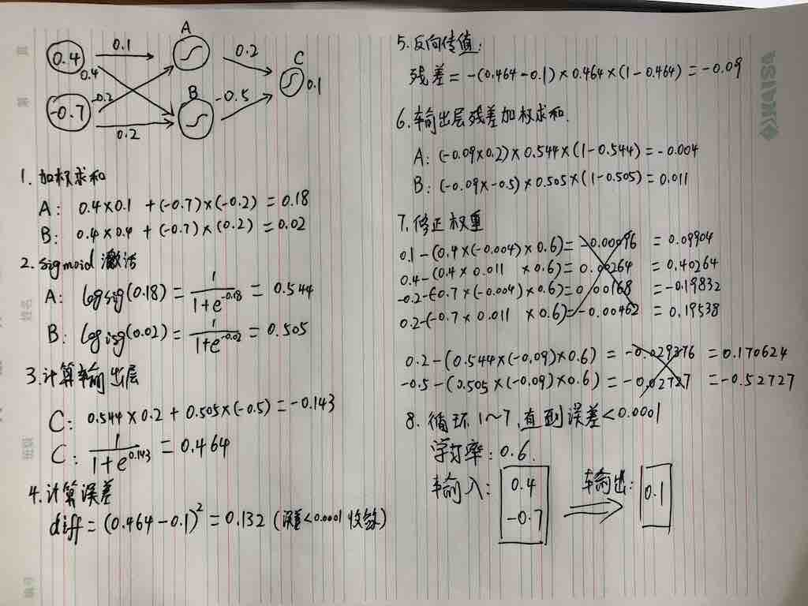

# Neural Network

## 教程样本


## 开发


## 案例结果
```
name:加法 | diff:0.000001 | data: 1000 | count:100000 | layer:[5 4 3 2]
训练：10000000/100000000(10.0%) | 误差：0.00015892 | 成功率：78.10%
训练：20000000/100000000(20.0%) | 误差：0.00011990 | 成功率：89.30%
训练：30000000/100000000(30.0%) | 误差：0.00008638 | 成功率：92.40%
训练：40000000/100000000(40.0%) | 误差：0.00006411 | 成功率：94.60%
训练：50000000/100000000(50.0%) | 误差：0.00005240 | 成功率：95.60%
训练：60000000/100000000(60.0%) | 误差：0.00004542 | 成功率：96.20%
训练：70000000/100000000(70.0%) | 误差：0.00004080 | 成功率：97.00%
训练：80000000/100000000(80.0%) | 误差：0.00003750 | 成功率：97.20%
训练：90000000/100000000(90.0%) | 误差：0.00003500 | 成功率：97.40%
训练：100000000/100000000(100.0%) | 误差：0.00003299 | 成功率：97.90%

学习次数: 100000000
检测:true | 期望：0.33949912 | 结果：0.33965547 | 误差：0.00000002    
检测:1000 | 成功：979 | 成功率:97.90%
```

```
2020/10/31 10:25:59 MNISST train: N:60000 | W:28 | H:28
2020/10/31 10:25:59 MNISST test: N:10000 | W:28 | H:28
name:MNIST | diff:0.010000 | data: 60000 | count:100 | layer:[5 5 5 5]
训练：600000/6000000(10.0%) | 误差：0.77812836 | 成功率：79.47%
训练：1200000/6000000(20.0%) | 误差：0.79004662 | 成功率：82.13%
训练：1800000/6000000(30.0%) | 误差：0.79282369 | 成功率：82.36%
训练：2400000/6000000(40.0%) | 误差：0.79277570 | 成功率：82.86%
训练：3000000/6000000(50.0%) | 误差：0.79238390 | 成功率：83.21%
训练：3600000/6000000(60.0%) | 误差：0.79181424 | 成功率：83.58%
训练：4200000/6000000(70.0%) | 误差：0.78959911 | 成功率：83.41%
训练：4800000/6000000(80.0%) | 误差：0.79034415 | 成功率：83.50%
训练：5400000/6000000(90.0%) | 误差：0.79045410 | 成功率：83.50%
训练：6000000/6000000(100.0%) | 误差：0.79155208 | 成功率：83.52%

学习次数: 6000000
检测:true | 期望：0.60000000 | 结果：0.57622696 | 误差：0.00056516    
检测:10000 | 成功：8352 | 成功率:83.52%
```